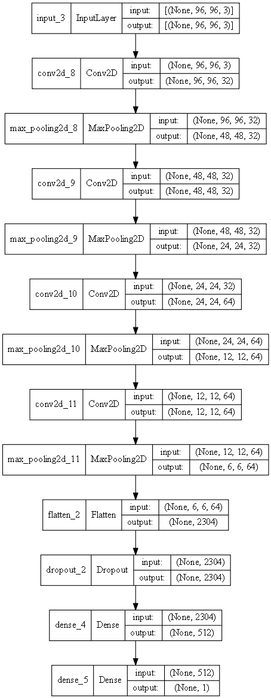
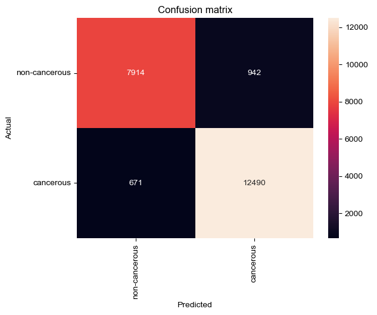
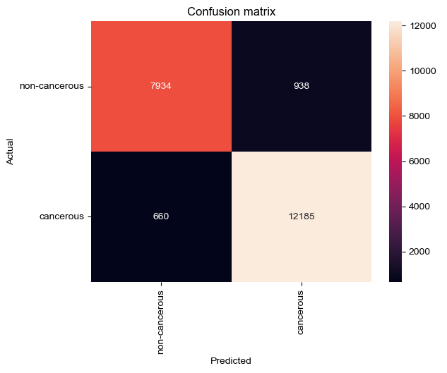

## Histopatologinen syövän tunnistus 

**Tekijä:** Santeri Moilanen, santerimoilanen@gmail.com

**Tiivistelmä**: Tutkimusartikkelin [Deep Convolutional Neural Network with TensorFlow and Keras to Classify Skin Cancer Images](https://www.researchgate.net/publication/343409875_Deep_Convolutional_Neural_Network_with_TensorFlow_and_Keras_to_Classify_Skin_Cancer_Images) neuroverkkoarkkitehtuurin replikointi ja optimointi.

## Testattu seuraavilla kirjastoilla

- [Python 3.9.12](https://www.python.org/)
- [Tensorflow 2.7.0](https://www.tensorflow.org/overview/?hl=fi)
- [Pandas 1.4.3](https://pandas.pydata.org/)
- [NumPy 1.23.2](https://numpy.org/)
- [sklearn 1.1.1](https://scikit-learn.org/)
- [matplotlib 3.5.2](https://matplotlib.org/)
- [seaborn 0.12.1](https://seaborn.pydata.org)
- [opendatasets 0.1.22](https://github.com/JovianML/opendatasets)

## Johdanto
Ei-melanooma peräiset ihosyövät ovat erityisen yleisiä vaaleaihoisella eurooppalaista syntyperää olevilla ihmisillä. [Ferlay ym. (2021, sivu 787.)](https://doi.org/10.1002/ijc.33588) Ne ovat Pohjois-Euroopan toiseksi yleisempiä syöpiä. [Ferlay ym. (2021, sivu 785.)](https://doi.org/10.1002/ijc.33588) Altistuminen ultraviolettisäteilylle, joko suoraan auringon tai solariumin kautta on suurin syy ihosyöpä tapauksien kasvulle [Gordon ja Rowell (2015, sivu 141)](https://doi.org/10.1097/CEJ.0000000000000056). Gordon ja Rowell [(2015, sivu 146)]( https://doi.org/10.1097/CEJ.0000000000000056) mukaan ennaltaehkäisyllä saavutettaisiin kustannussäästöjä ja saataisiin ihosyöpä vähenemään.

Voisiko ennaltaehkäisyn keinona toimia syväoppimismalli, joka osaa tunnistaa syöpää histopatologisistakuvista? Hyvin kehitetty malli voisi toimia lääkärin tukena diagnostisoidessa  syöpää potilaalta ja jopa tehdä diagnosointia lääkäriä paremmin. Tämä voisi tehostaa lääkärin työtä ja auttaa syövän löytämisessä varhaisessa vaiheessa. Tämä näkyisi terveydenhuollon kulujen vähenemisenä sekä lisääntyneinä elinvuosina ihosyöpää sairastavien potilaiden joukossa. 

## Tehtävänanto

Tarkoituksena on kehittää syväoppimismalli, joka tunnistaa histopatologisistakuvista ihosyöpää. Syväoppimismallin pohjana käytetään "Deep Convolutional Neural Network with TensorFlow and Keras to Classify Skin Cancer Images" tutkimusartikkelin arkkitehtuuria. Tätä arkkitehtuuria on tarkoitus iteroida paremmaksi arkkitehtuuri ja hyperparametrien muunnoksella.

## Data

Työssä on käytössä datasetti [Histopathologic Cancer Detection](https://www.kaggle.com/c/histopathologic-cancer-detection), joka on peräisin Kagglesta julkaistusta kilpailusta. Kuvat on jaettu CSV tiedoston "id" ja "label"- kenttien perusteella syöpää sisältäviksi tai ei syöpää sisältäviksi. Kuvat ovat kooltaan 96x96 pikseliä ja syöpää sisältävissä kuvissa on keskellä 32x32 pikselin kokoinen alue, joka sisältää vähintään yhden pikselin verran kasvainkudosta. Datasetti ei sisällä kaksoiskappaleita kuvista. Kuvia, joiden luokka on tiedossa, on yhteensä 220 025 kappaletta. Niistä 40.5 % ovat syöpää sisältäviä kuvia ja loput 59.5 % ei syöpää sisältäviä. Loput 57 458 kuvaa ovat tarkoitettu Kaggleen kilpailua varten, jolloin niiden luokat eivät ole tiedossa.

## Esikäsittely

Datasetin kuvat jaetaan 80:10:10 suhteella opetus-, testi- ja validointidata kansioihin. Kaikkien kansioiden sisällä on kansiot "cancerous" ja "non-cancerous" sen mukaan onko kuvassa syöpää vai ei. 
Opetusdataan sovellettiin datan augmentaatiota, jolla saadaan todenmukaisia muutoksia opetusdataan. Nämä muunnokset sisälsivät sattumanvaraisen kuvan käännön vaakasuoraan, sekä kuvan siirroksia vaaka- ja pystyakseleilla. Jos esimerkiksi ajatellaan kuvaa, jossa on syöpä niin, sillä miten päin kuva on otettu ei ole väliä tai sillä onko havainto aivan kuvan keskellä.

## Metodologia

Esikäsittelyn jälkeen datasettiä voidaan käyttää binääriluokitteluongelmaan ja selvittää onko kuvassa syöpää vai ei. Opetus- ja testidata kansioiden dataa käytetään syväoppimismallin kehittämiseen ja validointidata pidetään mallille aiemmin tuntemattomana datasettinä, jolla tullaan arvioimaan mallin lopullinen suorituskyky. Tavoite on, että malli suoriutuu mahdollisimman hyvin validointidataa vastaan. Tutkimusartikkelissa sovellettu malli kykeni 93.93 % tarkkuuteen aiemmin tuntematonta dataa vastaan. Tutkimuksessa käytetty datasetti oli HAM10000, joka koostuu 10 015 dermatologisesta kuvasta. Luokittelu ongelma oli moniluokittelua, jossa mallin tuli luokitella seitsemää eri ihosyöpätyyppiä.

Parhaan arkkitehtuurin ja optimaalisten hyperparametrien löytämiseksi tullaan käyttämään grid searchiä. Grid seachissa tullaan etsimään eri hyperparametrikombinaatioiden joukosta parhaan tarkkuuden tuottava mallia. Pohjana tullaan käyttämään tutkimuksen arkkitehtuuria, joka on muokattu moniluokittelun sijaan tukemaan binääriluokittelua. Lisäksi sisääntulokerroksen kuvankoko poikkeaa tässä käytetystä mallista. Alla oleva taulukko kuvastaa käytössä olevia hyperparametrejä ja antaa jokaisesta esimerkin ja selitteen.

| Hyperparametri | Esimerkkiarvo | Selitys 
| :-: | :-: | :-: |
| data_path | data | Arvo, joka määrää sen käytetäänkö laajaa vai rajoitettu testidatasettiä.
| lr | 0.001 | Oppimisnopeus.
| optimizer | Adam | Optimoija.
| epochs | 20 | Epochien lukumäärä.
| b_size | 10 | Batch koko ajoissa.
| num_classes | 1 | Ennustettavien luokkien määrä. Ulostulokerroksen neuronien määrä.
| n_filters | 32, 32, 64, 64 | Määrittelee arkkitehtuurin konvoluutio ja max-pooling kerrosten muodon.
| act | relu | Aktivointifunktio.
| drop_out | 0.3 | Verkon lopussa olevan drop_out kerroksen arvo.

Jokainen malli ajettiin kahdesti, sillä mallin satunnaisen alustuksen takia tulokset poikkeavat eri ajojen välillä hieman. Koska työssä oli käytössä kohtalaisen suuri kuvadatasetti niin laajempi grid search jouduttiin toteuttamaan rajoitetulla datasetillä, ettei siihen kuluisi kohtuuttomasti aikaa. 

Ensimmäisessä vaiheessa verrataan tutkimuksen arkkitehtuuria kahteen muuhun arkkitehtuurin laajalla datasetillä. Arkkitehtuurit eroavat alkuperäisestä "n_filters" parametrin osalta (ks. [ensimmäisen vaiheen configuraatio](./models_20221023T2328/cfgs.txt)). Malleja opetettiin 20 epochin verran. 
Mallien tuottamia tuloksia voi tarkastella tiedostosta [best_results.txt](./models_20221023T2328/best_results.txt) ja keskimääräisiä tuloksia tiedostosta [avg_results.txt](./models_20221023T2328/avg_results.txt). Ensimmäisen vaiheen jälkeen parhaaksi osoittautunut "n_filter" = [32, 32, 64, 64] arvo otettiin käyttöön toiseen vaiheeseen, jossa tehtiin kattavampaa hyperparametrien optimointia pienemmällä datasetillä. Yhteensä toisessa vaiheessa kokeiltiin 54 eri konfiguraatiota ja parhaaksi osoittautuivat "{'act': 'relu', 'b_size': 10, 'data_path': 'data_limited', 'drop_out': X, 'epochs': 20, 'lr': 0.001, 'n_filters': [32, 32, 64, 64], 'num_classes': 1, 'optimizer': 'Adam', 'name': '2D-CNN-31'}", missä drop_out X vaihteli arvojen 0.3, 0.4 & 0.5 välillä. Toisen vaiheen mallien tuottamia tuloksia voi tarkastella tiedostosta [best_results.txt](./models_20221025T1510/best_results.txt) ja keskimääräisiä tuloksia tiedostosta [avg_results.txt](./models_20221025T1510/avg_results.txt). Kolmannessa vaiheessa parhaat kolme mallia ajettiin uudestaan laajalla datasetillä. Käytännössä malleja ajettiin kuitenkin vain kaksi, sillä yksi parhaista oli jo ajettu vaiheessa yksi. Kolmannen vaiheen mallien tuottamia tuloksia voi tarkastella tiedostosta [best_results.txt](./models_20221028T1838/best_results.txt) ja keskimääräisiä tuloksia tiedostosta [avg_results.txt](./models_20221028T1838/avg_results.txt). Parhaaksi malliksi osoittautui vaiheen yksi [malli](./models_20221023T2328/models/2_v1.hdf5)  

Ensimmäisen vaiheen oppimiskäyrissä konfiguraatioiden yksi ja kaksi käyrät ovat hyvin samankaltaiset ja tarkkuudessa on eroa vain 0.14 prosenttiyksikön verran (ks. [vaiheen 1 oppimiskäyrät](./models_20221023T2328/learning_curves.pdf). Kuitenkin konfiguraatiossa kolme mallin syventäminen aiheutti hieman heittelyä validointitarkkuuden käyriin ja heikensi myös tarkkuutta. [Toisen vaiheen oppimiskäyrissä](./models_20221025T1510/learning_curves.pdf) on nähtävissä osissa konfiguraatioissa jumiutumista johonkin tiettyyn arvoon. Tätä saattaa selittää käytetyn konfiguraation lisäksi myös rajoitettu opetusdatan määrä, mikä selvästi heikensi tuloksia. Suurempaa heittelyä opetus- ja validointitarkkuuksien välillä on myös havaittavissa. [Kolmannen vaiheen oppimiskäyrät](./models_20221028T1838/learning_curves.pdf) ovat vastaavia kuin vaiheessa yksi ja tarkkuus ei merkittävästi eroa ensimmäisen vaiheen parhaaseen malliin verrattuna. 

## Virheanalyysi

Mallin suoriutumisen arvioon käytetään sekaannusmatriisia, tarkkuutta sekä F1- mittarin tuottamia tuloksia. Näiden mittarien pohjalta tullaan valitsemaan parhaiten suoriutuva mallia, jota vasten ajetaan vielä Kaggleen tehtävä arviointi, sillä käytetty testidata on alkuaan peräisin Kagglen tarjoamasta kilpailusta.

Parhaan mallin suorituskyky evaluointidataa vastaan:

| TP | TN | FN | FP | ACC | PREC | REC | FSCORE
| :-: | :-: | :-: | :-: | :-: | :-: | :-: | :-: |
| 12490 | 7914 | 671 | 942 | 0.92674 | 0.92987 | 0.94902 | 0.93934 |

Sekaannusmatriisista nähdään, missä suhteessa mallin luokittelu osuu kohdallaan ja missä luokassa se antaa eniten vääriä vastauksia. Koska kyseessä on lääketieteellistä aineistoa niin tässä kohtaa false negative olisi potilaan kannalta pahin mahdollinen tulos, sillä silloin malli väittäisi, että kuvassa ei ole syöpää, vaikka todellisuudessa siinä on. Näin ollen mallin kynnysarvon muuttaminen 0.5 johonkin muuhun arvoon voisi parhaassa tapauksessa lisätä luokittelutarkkuutta ja/tai vähentää false negatiivisten osuutta. Kuitenkin arvon muuttaminen johonkin muuhun kuin 0.5 heikensi tarkkuutta, joten arvo päätettiin pitää muuttumattomana.

## Tulokset, virheanalyysi ja jatkotoimenpiteet

Parhaan mallin suorituskyky testidataa vastaan:

| TP | TN | FN | FP | ACC | PREC | REC | FSCORE
| :-: | :-: | :-: | :-: | :-: | :-: | :-: | :-: |
| 12185 | 7934 | 660 | 938 | 0.92642 | 0.92852 | 0.94862 | 0.93846 |

Parhaan mallin suorituskyky pysyi lähes samana testidataa vastaan. Alla oleva histogrammi havainnollistaa yllä olevia TP, TN, FN & FP arvoja vielä paremmin.

Suorituskyvyn pysyminen suhteellisen samana tuntemattomalla aineistolla on hyvä merkki, sillä se kertoo siitä, että malli ei ole ali- tai ylioppinut. Malli päätettiin arvioida myös Kagglessa ja alla näkyvät Kagglen tarjoamat pisteytykset mallille.

Parhaan mallin suorituskyky Kagglen tuntematontadataa vastaan:
| private score | public score |
| :-: | :-: |
| 0.921 | 0.9468 |

Tutkimuksessa käytetty malli saavutti 93.93 % tarkkuuden tuntemattomalla datalla. Tässä päästiin siis varsin lähelle kyseistä arvoa. Tosin huomion arvoista on se, että käytetty datasetti oli eri ja tutkimuksessa kyse oli moniluokitteluongelmasta verrattuna tämän työn binääriluokitteluun.

Mallin tarkkuutta olisi mahdollista parantaa entisestään, mikäli datan laatuun kiinnitettäisiin enemmän huomiota. Dataa visualisoidessa havaittiin, että joukossa oli jonkin verran ali- tai ylivalottuneita kuvia. On myös mahdollista, että kaikista kuvista ei ole tehty oikeasti kattavaa selvitystä onko kyseessä ollut syöpää vai ei ja duplikaatit samasta tapauksesta ovat myös mahdollisia. Erilaiset data-augmentaation metodit voisivat myös olla potentiaalisia kehityskohteita olemassa olevalle mallille. Kuitenkin näiden lisääminen grid searchiin olisi kasvattanut jo ennestään aikaa vievän laskennan paljon korkeammaksi. Siirto-oppiminen voisi myös olla toimiva tapa parantaa mallin suorituskykyä ja se ei vaatisi niin paljon resursseja laitteistolta, kuin nykyinen malli. Erityisesti silloin, jos siirto-oppimiseen käytetystä mallista on saatu jo aiemmin hyviä tuloksia lääketieteellisten kuvien luokittelun saralla. 